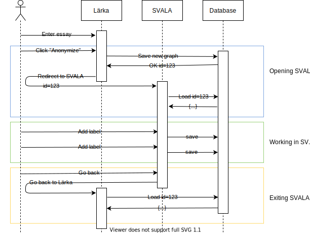

# Lärka db

Just testing a method of opening an arbitrary essay in Svala:

1. Our app (e.g. the Texteval environment in Lärka) accepts essay input from user
2. When user wants to open Svala, we save the essay in a custom database with a Svala-compatible API
3. We open Svala with the `backend` and `essay` parameters set
4. Svala opens our essay and saves changes through the API
5. When exiting Svala, our app reloads the latest version of the essay from the database

## Plan

We'll publish a super simple implementation of the API that swell-portal uses, only to provide Svala with a sample essay.

To showcase it, we'll make a very simple app (in place of Lärka Texteval) for the user to input an essay, open Svala and return to our app.

## Notes

- The db part (not the gui) could perhaps be distributed as an example project for helping Svala users get started?
